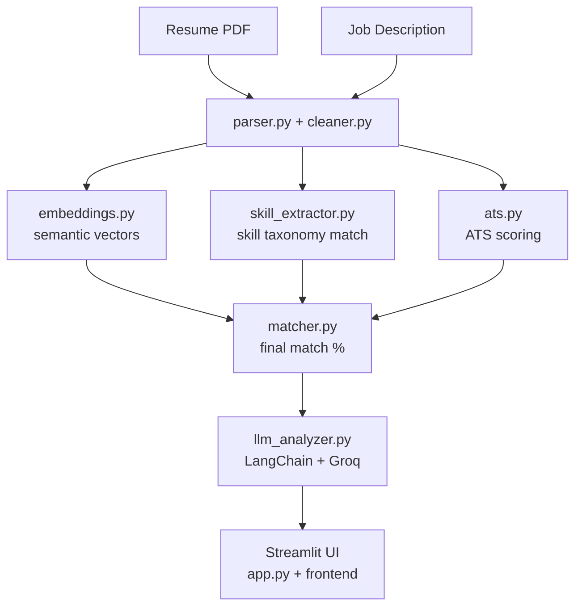
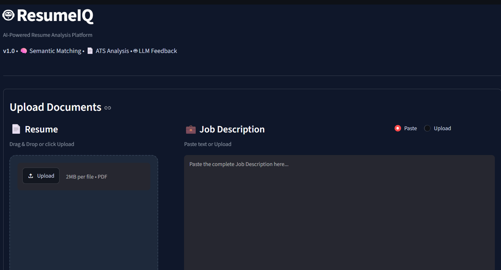
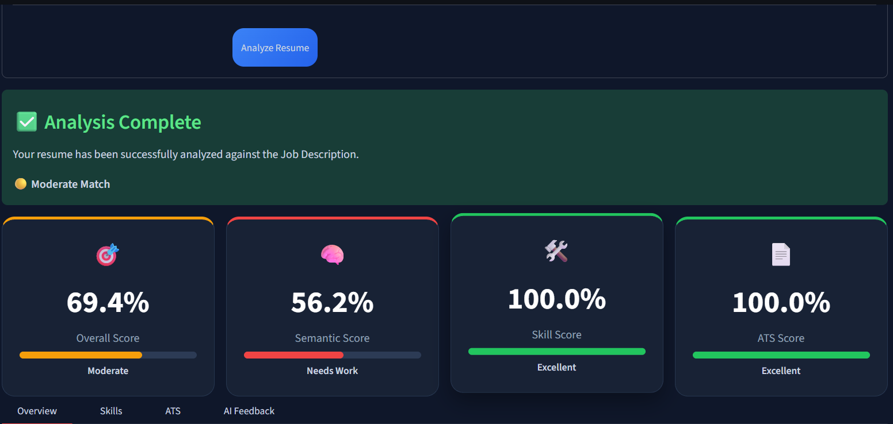
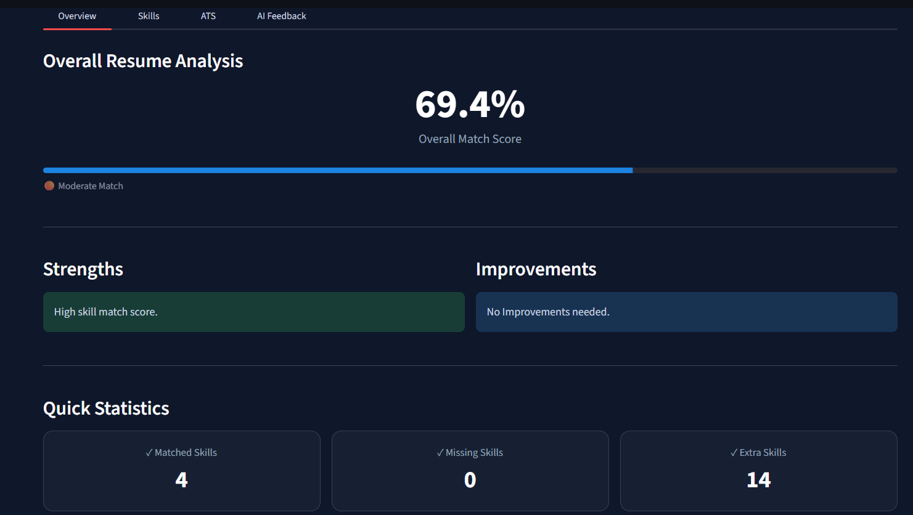
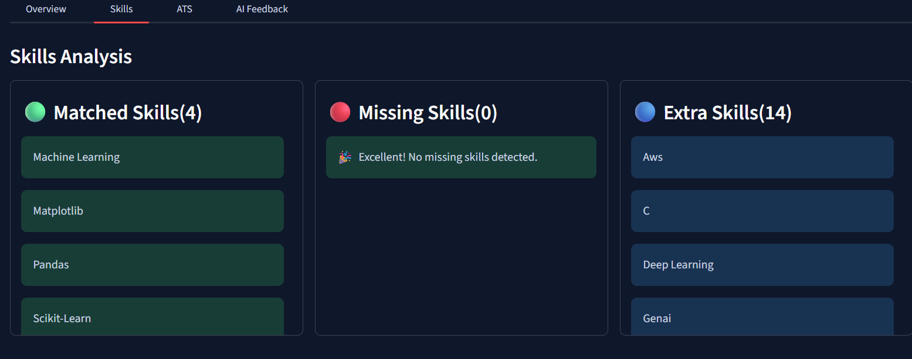
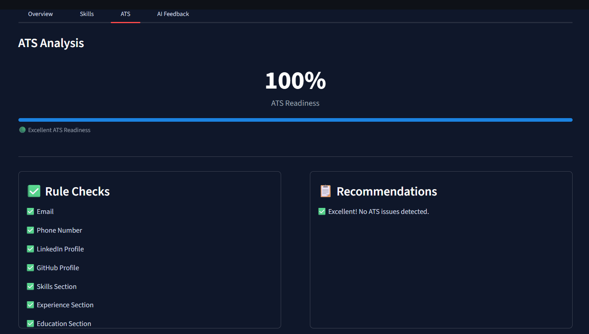
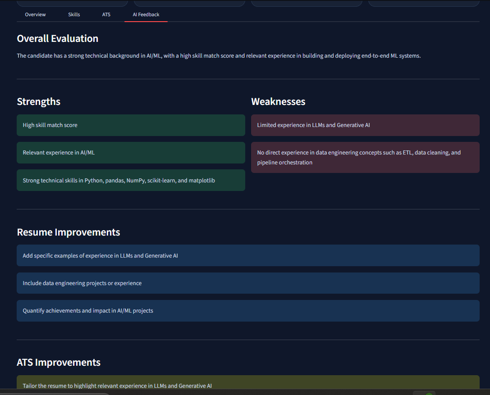

# 🎯 AI-Powered Resume Screener & ATS Analyzer

An intelligent resume-to-job-description matching system that parses resumes, extracts skills, scores ATS compatibility, computes semantic similarity against a job description, and generates AI-powered feedback using an LLM — all wrapped in an interactive Streamlit dashboard.

---

## ✨ Features

- **📄 Resume Parsing** — Extracts structured text and metadata from PDF resumes.
- **🧹 Text Cleaning & Normalization** — Prepares raw resume/JD text for downstream NLP tasks.
- **🧠 Semantic Matching** — Uses Sentence-Transformer embeddings to compute similarity between resume content and job description.
- **🛠️ Skill Extraction** — Identifies technical and soft skills from resume text against a curated skills taxonomy.
- **✅ ATS Compatibility Scoring** — Evaluates formatting, keyword coverage, and structural factors that affect ATS parsing.
- **🤖 LLM-Powered Feedback** — Uses LangChain + Groq to generate actionable, human-readable suggestions for improving the resume against a target JD.
- **📊 Interactive Dashboard** — Visual breakdown of match score, skill gaps, and ATS metrics via a custom Streamlit frontend.

---

## 🏗️ Architecture

The pipeline follows a modular flow: a resume and job description are parsed and cleaned, run through embedding-based semantic matching and rule-based ATS/skill analysis, and finally passed to an LLM for qualitative feedback — with all results rendered in the Streamlit UI.



---

## 📁 Project Structure

```
├── app.py                      # Streamlit entry point
├── config/                     # Logging configuration
├── data/                       # Sample resume, JD, and skills taxonomy
├── frontend/
│   ├── components/             # UI components (uploader, ATS view, metrics, skills, LLM feedback, etc.)
│   ├── styles/                 # Custom CSS theming
│   └── utils/                  # Style loader utilities
├── modules/
│   ├── parser.py                # Resume PDF parsing
│   ├── cleaner.py                # Text cleaning & normalization
│   ├── embeddings.py             # Sentence-Transformer based embeddings
│   ├── matcher.py                 # Resume-JD similarity matching
│   ├── skill_extractor.py         # Skill extraction against taxonomy
│   ├── ats.py                     # ATS compatibility scoring
│   └── llm_analyzer.py            # LangChain + Groq powered feedback
├── logs/                        # Module-level log files
├── tests/                       # Unit tests for each module
└── requirements.txt
```

---

## 🚀 Getting Started

### Prerequisites

- Python 3.11+
- A [Groq API key](https://console.groq.com/)

### Installation

```bash
# Clone the repository
git clone https://github.com/Abhaybh025/<repo-name>.git
cd <repo-name>

# Create and activate a virtual environment
python -m venv venv
source venv/bin/activate   # On Windows: venv\Scripts\activate

# Install dependencies
pip install -r requirements.txt
```

### Environment Variables

Create a `.env` file in the project root:

```env
GROQ_API_KEY=your_groq_api_key_here
```

### Run the App

```bash
streamlit run app.py
```

The app will open in your browser at `http://localhost:8501`.

---

## 🧪 Running Tests

```bash
python -m tests.test_file
```

---

## 🛠️ Tech Stack

| Layer            | Technology                        |
|------------------|------------------------------------|
| Frontend         | Streamlit, custom CSS              |
| Resume Parsing   | PDF text extraction                |
| Embeddings       | Sentence-Transformers               |
| LLM Feedback     | LangChain + Groq                    |
| Scoring Logic    | Custom Python (ATS + skill matching)|


---

## 📸 Screenshots

> _Add screenshots of the dashboard here, e.g.:_
>
> 
> 
> 
> 
> 
> 

---

## 🗺️ Roadmap

- [ ] Deploy to Streamlit Cloud
- [ ] Expand skills taxonomy coverage

---

<!-- ## 📄 License

This project is licensed under the MIT License — see the [LICENSE](LICENSE) file for details. -->
<!-- 
--- -->

## 🙋 Author

**Abhay Bhardwaj**
GitHub: [@Abhaybh025](https://github.com/Abhaybh025)
